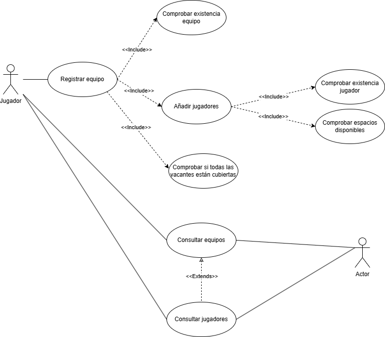
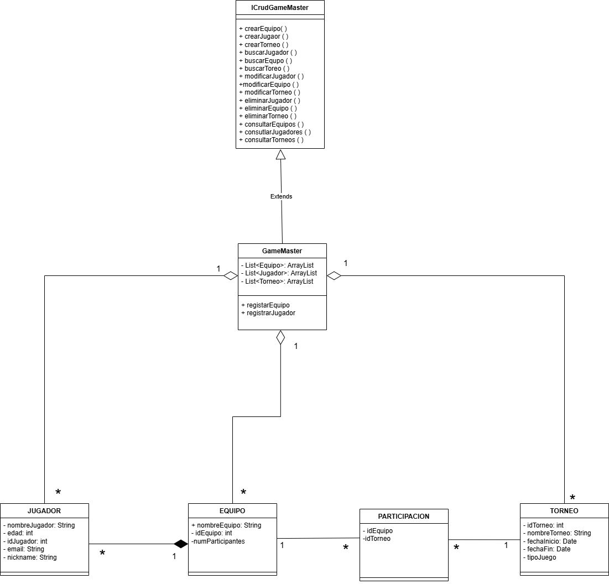

# torneo-esports-uml

## Autor
Iván Díaz Moreno
ivXLR8
## Descripción del Proyecto

https://github.com/ivXLR8/torneo-esports-uml/tree/main
Este proyecto implementa un sistema de gestión de torneos de eSports utilizando UML para el modelado y Java para la implementación.

Se ha diseñado una aplicación para gestión de torneos, usando un enfoque orientado a objetos con una interfaz CRUD (ICrudGameMaster) y una implementación concreta (GameMaster), con clases de entidad: Jugador, Equipo, Torneo y Participacion.

## Diagramas UML
### Diagrama de Casos de Uso

Este diagrama representa la interacción de **dos actores** con el sistema:

- **Jugador**: Tiene la capacidad de registrar nuevos equipos, añadir jugadores a un equipo y consultar tanto los equipos registrados como los jugadores inscritos.
- **Actor genérico (externo o público)**: Puede acceder a las consultas de equipos y jugadores, sin necesidad de tener permisos especiales.

El sistema automatiza diversas verificaciones importantes durante el proceso:
- Comprueba si un equipo o jugador ya existe antes de permitir su registro.
- Valida que haya **espacios disponibles** en los equipos antes de permitir añadir jugadores.
- Antes de registrar un equipo, verifica si todas las **vacantes están cubiertas** (es decir, el número de jugadores requeridos está completo).

Este enfoque garantiza la **integridad del sistema** y previene inconsistencias en los datos, asegurando que cada equipo registrado cumpla con los requisitos mínimos para participar en los torneos.

### Diagrama de Clases

#### 🧑‍🎮 `Jugador`
- **Atributos:**
  - `nombreJugador: String`
  - `edad: int`
  - `idJugador: int`
  - `email: String`
  - `nickname: String`

---

#### 🛡️ `Equipo`
- **Atributos:**
  - `nombreEquipo: String`
  - `idEquipo: int`
  - `numParticipantes: int`

---

#### 🏆 `Torneo`
- **Atributos:**
  - `idTorneo: int`
  - `nombreTorneo: String`
  - `fechaInicio: Date`
  - `fechaFin: Date`
  - `tipoJuego: String`

---

#### 🔗 `Participacion`
- **Atributos:**
  - `idEquipo: int`
  - `idTorneo: int`

Clase intermedia que establece una relación `N:M` entre `Equipo` y `Torneo`. Cada entrada representa la participación de un equipo en un torneo específico.

---

### 🔶 Lógica de Control

#### 🧩 `ICrudGameMaster` (Interfaz)
Interfaz que define las operaciones básicas del sistema:
- Crear: `crearJugador()`, `crearEquipo()`, `crearTorneo()`
- Consultar: `consultarJugadores()`, `consultarEquipos()`, `consultarTorneos()`
- Buscar: `buscarJugador()`,`buscarEquipo()`, `buscarTorneo()` .
- Modificar y eliminar: `modificarJugador()`,`modificarEquipo()`,`modificarTorneo()`,`eliminarJugador()`,`eliminarEquipo()`,`eliminarTorneo()`.

---
#### 🧠 `GameMaster` (Clase de Control)
- **Implementa:** `ICrudGameMaster`
- **Contiene:**
  - `List<Jugador> jugadores`
  - `List<Equipo> equipos`
  - `List<Torneo> torneos`
- **Métodos principales:**
  - `registrarJugador()`
  - `registrarEquipo()`
  - Y todos los métodos definidos en la interfaz

---

### 🔗 Relaciones y Cardinalidades

- **Jugador `*` ─ `1` Equipo:**  
  Un jugador pertenece a un único equipo; un equipo puede tener múltiples jugadores.

- **Equipo `*` ─ `*` Torneo (mediante `Participacion`):**  
  Representación de una relación muchos a muchos entre equipos y torneos.

- **GameMaster `1` ─ `*` Jugadores/Equipos/Torneos:**  

## Estructura del Proyecto
torneo-esports-uml/ ├── src/
│ ├── es/empresa/torneo/
│ │ ├── modelo/
│ │ ├── control/
│ │ ├── vista/
│ │ ├── Main.java
├── diagrams/
│ ├── casos-uso.png
│ ├── clases.png
├── README.md
├── .gitignore
├── LICENSE (opcional)

## Instalación y Ejecución
1. Clonar el repositorio:
`git clone https://github.com/usuario/torneo-esports-uml.git`
2. Compilar y ejecutar el proyecto:
`cd src javac es/empresa/torneo/Main.java java es.empresa.torneo.Main`

## Justificación del diseño
Se ha considerado que los torneos de e-sports se rigen mayoritariamente por su enfoque a distancia por tanto, dar al jugador la posibilidad de registrar a un equipo en un torneo es lo más ótpimo.

Se han definido claramente las entidades principales (`Jugador`, `Equipo`, `Torneo`), separándolas de la lógica de control, que queda encapsulada en la clase `GameMaster`. Esto permite un diseño limpio y modular, donde cada clase tiene una responsabilidad única, favoreciendo la mantenibilidad y escalabilidad del proyecto.
La relación entre `Equipo` y `Torneo` se ha integrado mediante una clase intermedia `Participacion`, lo que permite representar correctamente una relación muchos a muchos (`N:M`) con posibilidad de ampliación futura (por ejemplo, añadiendo atributos como fecha inscripción, puntos, etc.).
La composición entre equipo y jugadores es por las normas descritas previamente, no puede existir un equipo si no tiene completas todas sus vacantes.
Se ha establecido una relación de agregación entre las clases (`Jugador`, `Equipo`, `Torneo`) para poder reutilizar estos objetos en otros escenarios, almacenandolos en una base de datos, pendiente de implementar.

## Conclusiones
Me ha permitido profundizar más en el proceso de plasmar una idea a una planificación más tangible y ver realmente como se implementa la programación orientada a ojetos. Me ha ayudado a comprender la importancia de separar las responsabilidades entre las diferentes clases. Observar un ejemplo realizado por mi de implementar una clase tipo Interfaz. 
Mayor comprensión de las diferentes relaciones entre clases, su aplicación y lógica detrás. 
